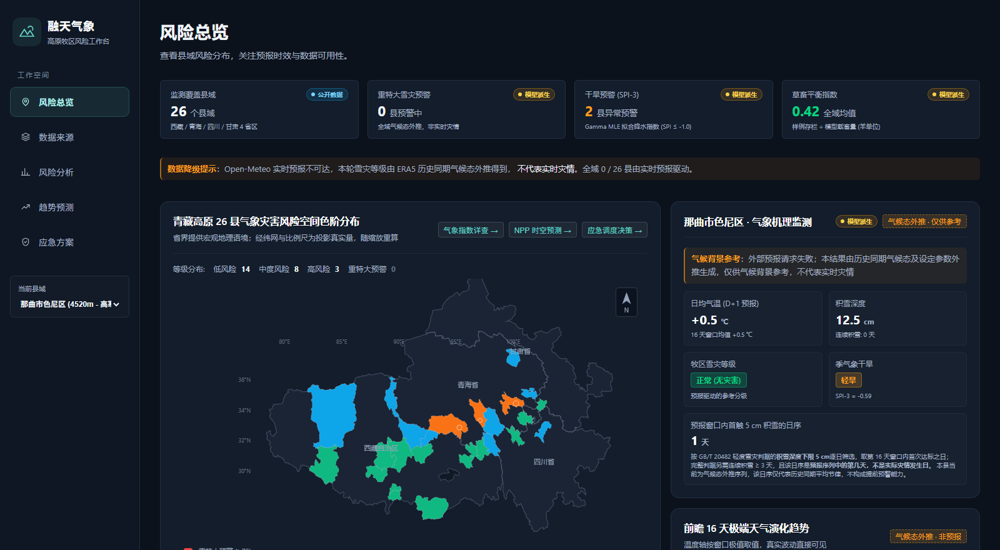
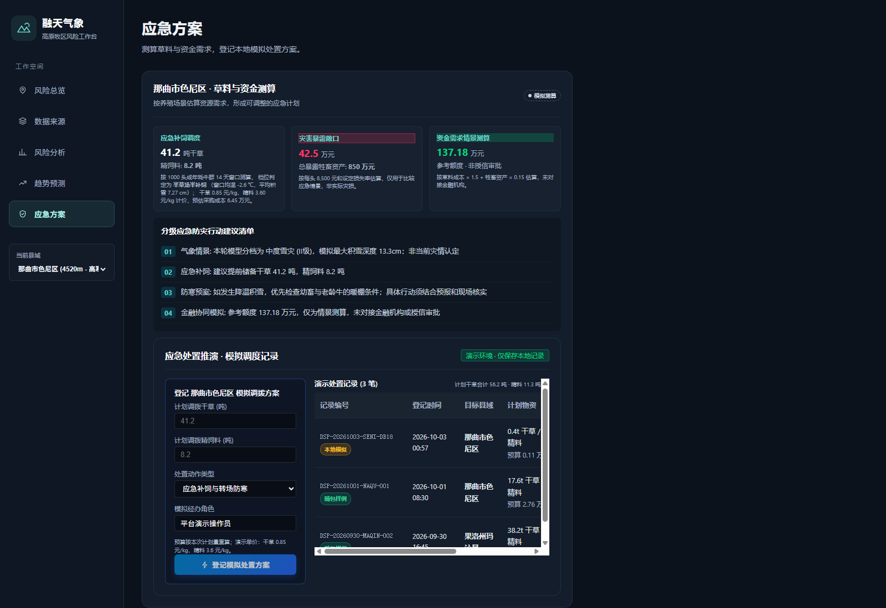

# 第八届全球校园人工智能算法精英大赛
## “智慧气象”算法主题赛 · 赛题方向（二）：气象赋能行业应用

# 融天气象 - 高原多源时空融合气象灾害预警平台
### Plateau Meteo-Risk Intelligent Warning & Decision Platform

> ⚠️ **双盲评审合规声明**：本参赛项目（含代码仓库、文档方案、交互界面及测试用例）严格恪守大赛双盲匿名评审原则，全篇不包含任何高校名称、院系所、指导教师及参赛团队个人姓名信息。

---

## 🖥️ 界面一览

| 风险总览 · 全域 26 县灾害空间分位 | 应急方案 · 草料与资金测算 / 模拟调度 |
|---|---|
|  |  |

> 上图为本机真实运行实例截图（零构建前端，`file://` 双击亦可打开）。页面右上角的数据状态标签会随预报源档位实时变化；缺数据时只显示错误态，不出现任何编造数值。

---

## 📌 项目概述与参赛导向

青藏高原平均海拔超 4,000 米，生态极端脆弱，冬季暴雪（白灾）、极寒冷冻与春季干旱（黑灾）对高寒畜牧业造成严重的系统性风险。本项目聚焦**赛题方向（二）：气象赋能行业应用（特色农业 + 绿色金融）**，以解决高寒复杂地形下气象灾害监测“算法数学失真、样本标签污染、过度虚夸指标”三大硬伤为目标，构建了一套**理论严谨、零伪造数据、科学透明、开箱即用**的高原气象灾害智能预警与草畜平衡决策平台。

系统全面覆盖青藏高原 4 省区（西藏、青海、四川、甘肃）**26 个高寒牧区典型县域**，实现多源卫星遥感与再分析地表气象驱动的深度融合。

---

## 🔬 四大核心科学突破与算法重构

本项目拒绝套用黑盒模型与捏造假数据，立足于扎实的数学推导与权威同行评议科研文献复现：

### 1. 标准 Gamma 拟合 SPI 气象干旱指数 (`app/algorithm/spi.py`)
- **破除原版硬伤**：彻底解决传统简化正态 Z-score 抛弃零降水年份、起始年份硬编码、导致冬季干旱极端偏倚的问题。
- **理论实现**：采用极大似然估计 (MLE, `floc=0`) 拟合两参数 Gamma 分布；严格引入零降水概率边界 $q = m / N$，构建混合累积分布函数 $H(x) = q + (1 - q)G(x)$，经正态逆累积变换导出标准 SPI 分位数。
- **数据边界**：26 县新旧方法平均绝对差为 0.0985 SPI 单位。默认 scale=3 的代表月份扫描中，日喀则谢通门县 2025-01 出现 $q=0.20$；同月历史样本仅 5 年，参数估计不稳定，指标不宜解释为长期气候结论。

### 2. 论文级草地退化动力学指数 GDI 复现 (`app/algorithm/gdi.py`)
- **文献出处**：完整复现国际高水平期刊（*Li et al., 2025, Remote Sensing, 17(17), 3098*）。
- **破除原版硬伤**：克服旧版等权 Min-Max 简化导致 26 县在秋末全量落入同一退化等级（全域同级、无空间区分度）的严重缺陷。
- **理论实现**：构建 NPP、NDVI、植被覆盖度 (FVC)、折算草产量 4 维遥感生态空间，经 PCA 提取退化综合主成分（第一主成分贡献率 59.55%），融入高寒草甸 (0.70)、高寒草原 (1.00)、高寒荒漠 (1.35) 脆弱性系数，通过 K-Means 聚类结合曲率拐点划定分级阈值。
- **实测分布**：全域 26 县形成 4 县基本稳定（15.4%）、11 县轻度退化（42.3%）、8 县中度退化（30.8%）、3 县重度退化（11.5%）的真实梯次分布。

### 3. 正例-未标注学习 (PU Learning) 灾害风险评估 (`app/algorithm/pu_model.py`) ★ 核心创新
- **样本边界**：1,500 条县月记录中有 127 条带来源链接的已标注事件、1,373 条未标注记录。已标注记录含非气象事件，县域归属和气象关联仍待逐条核验；未标注不等于无灾害，不能计算真实误报率。
- **理论实现**：构建 Bagging-based PU 学习算法，通过子空间集成筛选出可靠负例集合，结合 Platt Scaling (`CalibratedClassifierCV`) 进行严谨的后验概率校准；集成 `shap.TreeExplainer` 计算 16 维特征的边际贡献度与增减向归因。
- **末年留出诊断**：2020–2023 年 1,200 条训练，2024 年 300 条留出；筛选可靠负例、拟合和校准只使用训练期。下表指标针对记录标签，不能解释为真实灾害识别成绩。

  | 方法 | 已标注召回率 | 未标注告警率 | 标签 F1 | 标签 Brier |
  |---|:---:|:---:|:---:|:---:|
  | 固定规则评分 | 1.0000 | 0.9785 | 0.1333 | 0.1525 |
  | 朴素监督（未标注按 0 训练） | 0.0000 | 0.0036 | 0.0000 | 0.0652 |
  | PU Learning | 0.4286 | 0.2401 | 0.1856 | 0.1602 |
  | Elkan-Noto 两步法 | 0.6667 | 0.5842 | 0.1414 | 0.4451 |

  完整划分与限制见 `tools/out/pu_temporal_evaluation.json`。

### 4. 26 县 × 25 年真实 MODIS NPP 时空预测与双向验证 (`app/algorithm/yield_forecast.py`)
- **真实数据基座**：基于 NASA MOD17A3HGF 26 县 × 25 年（2001–2025 年）共 **650 条真实年度观测**，融合 CMFD 与 ERA5 气象要素。严禁随机切分混淆！
- **双向严格交叉验证协议**：
  - **协议 A: 留一年交叉验证 (LOYO, 25 轮, 历史留年验证)**：
    - 多元气象 Ridge 回归 MAE 为 **0.0117 ± 0.0027**，相对历史气候态均值 (0.0142) 约低 17.4%，相对趋势基线 (0.0122) 约低 4.2%，相对三年移动平均 (0.0230) 约低 49%。
    - Ridge 使用 L2 正则化；留年训练可能包含目标年之后的资料，不能视作严格未来预测。县际 NPP 基数差异也会推高总体 $R^2$。
  - **协议 B: 留一县交叉验证 (LORO, 26 轮, 空间跨区迁移)**：
    - 在缺乏微尺度实测传感器、各方案 $R^2$ 均为负的严酷跨区条件下，环境梯度非线性回归仍实现未知县域预测 MAE 下降 **20.5%**（0.2060 vs 0.2592）。

---

## 💻 气象赋能行业应用落地（农业 + 金融）

系统打通“气象监测 $\to$ 灾害预警 $\to$ 草畜承载 $\to$ 应急储备 $\to$ 绿色金融”决策链路：
1. **防灾应急储备测算**：依据 GB/T 20482 雪灾等级与未来 14 天积雪窗口，动态测算各县应急干草与精饲料吨数及采购成本预算；
2. **绿色信贷与避险增信**：建立灾害暴露资产敞口测算模型，为农牧企业及合作社匹配差异化绿色低息信贷额度，化被动理赔为主动避险防灾；
3. **全域 26 县资源调度优先级**：横向对比 26 县综合风险指数，生成阶梯式补饲档位与累积覆盖度，辅助应急物资精准投送。

---

## 🚀 快速启动与本地复现

系统采用**极简、轻量、高内聚**的工程设计，单机普通 CPU 即可秒级启动并完成全量算法推断。

### 1. 环境准备
推荐使用 Python 3.10 ~ 3.13：
```bash
git clone https://github.com/saintjim224/qixiang.git
cd qixiang
pip install -r requirements.txt
```

### 2. 一键启动平台
- **Windows 用户**：双击根目录下 `start.bat` 脚本（或终端执行 `start.bat`）；
- **Linux / macOS 用户**：
  ```bash
  chmod +x run.sh
  ./run.sh
  ```
- **或直接通过 Python 命令行启动**：
  ```bash
  python -m uvicorn app.main:app --host 127.0.0.1 --port 8001
  ```

启动成功后，浏览器访问：
- **交互大屏驾驶舱**：[http://127.0.0.1:8001/](http://127.0.0.1:8001/)
- **交互式 API 文档 (Swagger)**：[http://127.0.0.1:8001/docs](http://127.0.0.1:8001/docs)

---

## 🧪 自动化测试验证

系统提供算法与业务路由回归测试：

```bash
pytest tests/ -v
```

```bash
node --test tests/frontend_state.test.js tests/frontend_charts.test.js
```

2026-10-08 复跑记录：Python **31 项通过**，Node 前端 **14 项通过**。覆盖 SPI/GDI、PU 训练隔离、NPP 基线与接口、预报缺测降级、接口契约留空口径，以及前端状态与图表语义。测试通过不证明来源记录真实或业务模型达标。

各算法模块亦支持**独立脚本运行**打印对照表：
```bash
python -m app.algorithm.spi
python -m app.algorithm.gdi
python -m app.algorithm.pu_model
python -m app.algorithm.yield_forecast
```

---

## 📂 项目结构全景

```
qixiang/
├── app/                        # 后端服务 (FastAPI)
│   ├── algorithm/              # 四大核心科学算法模块
│   │   ├── spi.py              # 标准 Gamma MLE SPI 气象干旱算法 (WMO 推荐理论框架)
│   │   ├── gdi.py              # 草地退化指数 GDI 复现 (Li et al., 2025, Remote Sensing)
│   │   ├── pu_model.py         # PU Learning 灾害风险评估与 SHAP TreeExplainer 归因
│   │   ├── yield_forecast.py   # MODIS 650 样本 NPP 时空预测与 LOYO/LORO 科学评测
│   │   ├── disaster.py         # GB/T 20482 暴雪与干旱复合灾害动力学判定
│   │   └── carrying.py         # 草畜平衡承载力与 14 天应急补饲调度测算
│   ├── api/                    # 23 个业务 API 端点
│   │   ├── overview.py         # 驾驶舱全景、26 县综合风险色阶、全量 GeoJSON 边界
│   │   ├── datasource.py       # 多源气象/遥感台账与权威溯源凭证
│   │   ├── index.py            # SPI/GDI/PU 指标查询与消融实验基准
│   │   ├── forecast.py         # NPP 预测、30 天积雪外推与 LOYO/LORO 对照
│   │   └── decision.py         # 应急补饲预算、绿色金融授信与 26 县优先级梯队
│   ├── core/                   # 核心数据 I/O、全局配置与 Pydantic 契约定义
│   └── data/                   # 26 县 2001-2025 年 650 样本真实 MODIS/ERA5 融合数据集
├── frontend/                   # 纯原生前端 (零打包步骤，直开可用)
│   ├── index.html              # 现代化数据可视化大屏 (5 大主题 Tab)
│   ├── css/main.css            # 现代化科学设计风格配色系统与响应式流式布局
│   ├── js/app.js               # 数据交互驱动逻辑 (全量真实后端数据，零伪造假常量)
│   └── vendor/                 # 本地离线依赖 (Vue 3.4.38 + ECharts 5.5.1，不依赖外网 CDN)
├── docs/                       # 赛事提交核心方案文档
│   ├── 参赛作品设计方案说明书.md  # 完整理论推导、架构设计与应用场景论证
│   ├── 可行性测试报告.md          # 测试规约、基准对照数据与科学指标达成报告
│   ├── 参赛前核验与改进清单.md    # 逐条核验记录与遗留事项
│   ├── 演示与答辩材料清单.md      # 演示动线、截图清单与截图命令
│   ├── images/                 # README 与材料用界面截图
│   ├── design/                 # 视觉设计提示词与设计规约
│   └── references/             # 同类作品拆解与启示分析 (仅分析文本)
├── tests/                      # 自动化测试用例套件 (Python pytest + Node test)
│   ├── test_spi.py             # SPI 算法边界与零降水混合 CDF
│   ├── test_gdi.py             # GDI 分级与脆弱性系数
│   ├── test_pu_model.py        # PU 训练/验证隔离
│   ├── test_yield_forecast.py  # NPP 基线与 LOYO/LORO 协议
│   ├── test_forecast_input.py  # 预报输入缺测与降级路径
│   ├── test_product_contracts.py  # 接口契约与数值留空口径
│   ├── frontend_state.test.js  # 前端派生量口径回归
│   └── frontend_charts.test.js # 前端图表语义回归
├── tools/                      # 取数与交叉校验工具 (只读，不改动算法主链)
│   ├── value_metrics_probe.py  # 应用成效指标取数
│   ├── cross_validate_spi.py   # SPI 第三方独立实现交叉校验
│   ├── evaluate_pu.py          # PU 四基线评测
│   ├── spi_window_ablation.py  # SPI 拟合窗口消融
│   ├── audit_event_labels.py   # 事件标签审计队列
│   ├── sync_data.py            # 数据内嵌打包 (一次性迁移工具)
│   └── out/                    # 上述脚本的实测输出 (文档数值的单一来源)
├── requirements.txt            # 依赖清单
├── start.bat                   # Windows 一键启动脚本
├── run.sh                      # Linux / macOS 一键启动脚本
└── README.md                   # 本说明文件
```

---

## 📊 数据真实性与权威溯源声明

本系统坚持“数据有源、方法透明、实测可验”，严禁编造任何无源数据：
1. **TPDC CMFD 2.0**：国家青藏高原科学数据中心，中国区域高分辨率地表气象驱动数据集 (1951–2024 年)；
2. **ECMWF ERA5**：全球地表气象再分析产品；随包子集为 2020–2025 年逐日记录；
3. **NASA MOD17A3HGF**：MODIS 地表植被净初级生产力年度真值观测 (2001–2025 年，26 县 × 25 年 = 650 条样本)；
4. **NASA MCD12Q2**：MODIS 全球地表植被物候产品；
5. **WMO Open-Meteo**：0–16 天实时预报接口；
6. **带来源的历史事件标签**：2020–2024 年共 127 条记录，含非气象事件；来源链接、发生县域、金额与气象关联仍需逐条核验。
